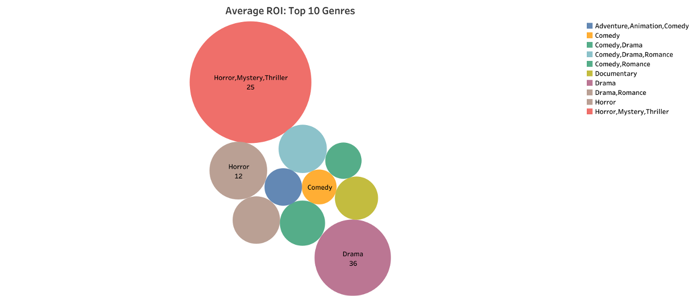
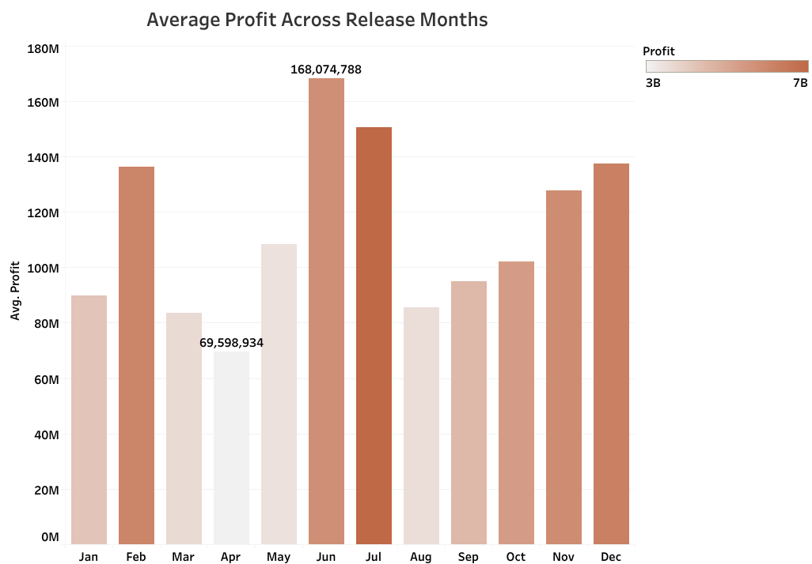
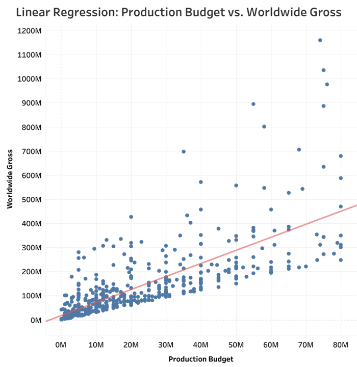

# Motion Magic Studios : Movie Analysis

**Authors and Contact Information:** 
- [Goknur Kaya](https://github.com/GoknurK) (Github/Presentation Lead)
- [Harshitha Thota](https://github.com/hthota1) (Technical Lead)

October 27, 2023

## Overview

Motion Magic Studios is embarking on an exciting journey into the world of cinema. This emerging film studio aims to analyze the most effective strategy for producing and releasing highly profitable movies while working within a budget. To achieve this, it will assess factors such as production budgets, revenue generation, film genres, and optimal release timing. This comprehensive analysis is intended to offer valuable insights and recommendations, helping Motion Magic Studios find success and profitability in their new endeavor.

## Business Problem

Entering the movie industry involves taking calculated risks and allocating funds wisely. Our goal is to develop a strategy that optimizes the effectiveness of each dollar our company invests as they establish their new film studio by examining data from previous films. Therefore, we calculated Return on Investment(ROI) to maximize the payoff. Our objective is to pinpoint the genre that offers the highest profitability within a mid-tier studio budget of $80 million. Furthermore, we will determine the most favorable month for releasing a movie in terms of return on investment (ROI) and examine the relationship between production budget and profitability. These insights will serve as valuable inputs for shaping our strategic decisions.

## Data Understanding

The data comes from multiple different film databases and sources - [IMDB](https://www.imdb.com/), [The Numbers](https://www.the-numbers.com/), [Box Office Mojo](https://www.boxofficemojo.com/), [Rotten Tomatoes](https://www.rottentomatoes.com/) and [TheMovieDB](https://www.themoviedb.org/).

For our conditions - where we're looking into budgets, movie genres, and release dates, we focused on using data from The Numbers and IMDB. 
These sources provided the richest and most valuable information for our research. These include information on title, genres, production budget, domestic and worldwide gross. We focused on films released between the years 2000-2020, calculated return on investment (ROI) and with a production budget of $80 million or under. Some of the limitations of our data include ambiguous data for some observations, financials adjusted for inflation and data integration challenges. 

## Methods

This project employs descriptive analysis, such as identifying the top-performing genres with an average ROI of $80 million or less, and illustrating the average profit based on the month of release for mid-budget genres, to bolster our recommendations. We selected ROI as the key metric, as it aligns with industry standards for calculating movie profits, as explained in this article on [how to calculate movie ROI](https://www.linkedin.com/pulse/how-can-one-calculate-roi-when-investing-movies-sharad-patel/). In addition, We also ran a regression to show how much production budget explains the variance of worldwide gross. ROI is calculated as worldwide gross divided by production budget multiplied by 100.

## Results


First, we focus on different genres and compare the ROI impact they had. We are looking to make movies with a budget of $80M, so the movies that fall under the "Horror, Mystery, Thriller" genre and Drama stand out. 



Next we looked at which month had the highest profit. June and July are the most profitable.



Lastly, The production budget explains 54% of the variation in worldwide gross. As you can see the more money you invest, the higher the returns are. There is a significant positive correlation as we expected. But that’s not always the case. Even with a lower end budget you can have higher significant returns. The studio can assess the risk vs reward. There are also some outliers above the trend line; we see the $80M movies made a profit of a $1B. 




## Conclusion

<h3 align="center">"Horror, Mystery, Thriller" Films Bring in High ROIs</h3>


After conducting data analysis, we can conclude that a movie that falls under "horror, mystery, thriller" genre will generate high ROI under the budget of $80M. Drama is the second highest ROI. 
June is the best month to release a movie to drive higher Return on Investment (ROI)


## Next Steps

Marketing
* Conduct a thorough marketing analysis to identify effective promotional strategies, which may include movie trailers, media advertising, and social media engagement. This analysis is crucial for building anticipation and excitement around new films.

Distribution
* Explore potential collaborations with larger production companies for distribution. Such partnerships can provide broader exposure and strategic placement of high-budget movies, extending into international markets.

Identifying and collaborating with successful directors in the film industry can be a strategic move for a studio aiming for box office success. 


## Additional Resources

- <p><a href="https://www.studiobinder.com/blog/production-budget/">Background on Production Budget</a></p>
- <p><a href="https://www.businessofbusiness.com/articles/a-brief-history-of-video-streaming-by-the-numbers/">Streaming Services History</a></p>
- <p><a href="https://www.businessofapps.com/data/video-streaming-app-market/#:~:text=In%20the%20mid%2D2000s%2C%20improvements,employees%20founded%20YouTube%20in%202005.">Streaming Sevices Popularity</a></p>

## For More Information

Please visit our full analysis in our [Jupyter Notebook](film_analysis.ipynb), [Slide Presentation](presentation.pdf), [Tableau Dashboard link](https://public.tableau.com/app/profile/harshitha.thota/viz/MovieStudioAnalysis/Dashboard) and watch our [Live Project Presentation](https://youtu.be/q1_d9o2uLHM?si=X-vRID8urU6vluAl&t=1337).

## Repository Structure

You are currently in the README.md file. The 'film_analysis.ipynb' file contains the jupyter notebook of the explaratory analysis of the given data that provides step-by-step guide to how we came to our conclusion. 'images' file contains the images used in this file. The images were taken from the internet.

```
├── data                                  <- Data file used in this project
├── images                                <- Images and Graphs used in this project obtained from external and internal source
├── .gitignore                            <- Contains list of files to be ignored from GitHub
├── film_analysis_presentation.pdf        <- Slide Presentation of the project
├── README.md                             <- Contains README file to be reviewed    
└── film_analysis.ipynb                   <- Jupyter notebook of the project containing codes and analysis
```


